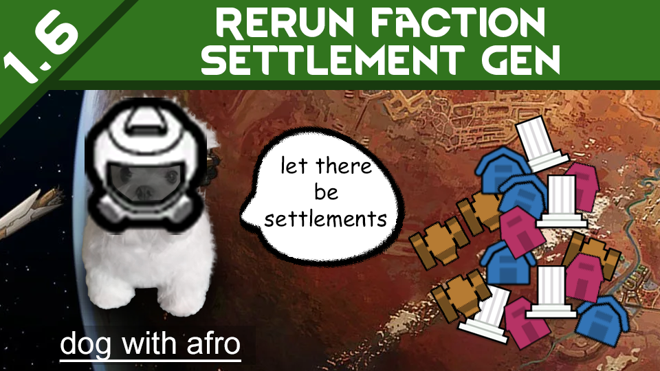

Source code for my workshop mod:
)

# *__TL;DR__* 
Spawns the missing world bases for a faction in an existing save. Go to **Mod Options** -> **Rerun Faction Settlement Gen**, pick a faction, and press the button. The mod places however many bases the faction should have had at world generation, using RimWorld's own settlement placement logic. Works with both planet-side factions and orbital factions.

---

Runs vanilla settlement generation for a faction of your choice, on an existing save. If a faction is missing bases they will be added back. You can also add factions to a save that previously were not in the save (perhaps they were removed by a mod or not added at world creation).

## Why does this exist

My save had the Traders Guild's platforms suppressed by another mod. They never came back after I removed the mod. I couldn't find a way or a mod that actually solved my issue and I didn't want to manually randomly place them using dev tools.

Thought it could help others in similar situations caused by mod issues (and only discovered after committing time to save...) or if you forgot to add a faction at world creation.

## How it works

Load your save, open **Options** -> **Mod Options** -> **Rerun Faction Settlement Gen**, pick a faction, and press the button. The mod works out how many bases the faction should have had at world gen (the vanilla per-layer formula), subtracts what it already owns, and spawns the difference.

Odyssey's Traders Guild platforms are placed correctly on the orbit layer (the mod respects the layer whitelist in the defs). If a faction def is missing from the save entirely, the mod can add that too.

An optional buffer setting keeps new bases at least N world tiles away from your settlements.

*See video in the media carousel for demo.*

## Notes

* **Safe to add or remove mid-save:** Nothing custom is written to the save file.
* **Localization:** UI is available in English, Simplified Chinese, Russian, Spanish, and German. Translations from English to other languages used machine translations. Feel free to let me know of any errors there.
